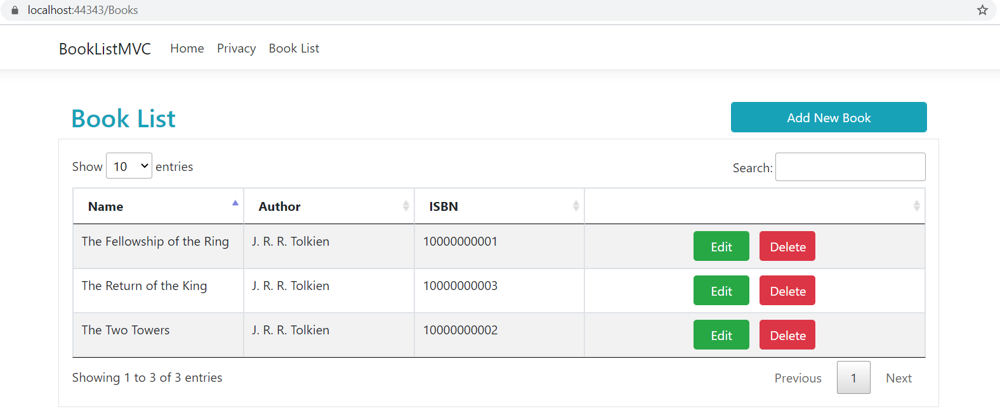
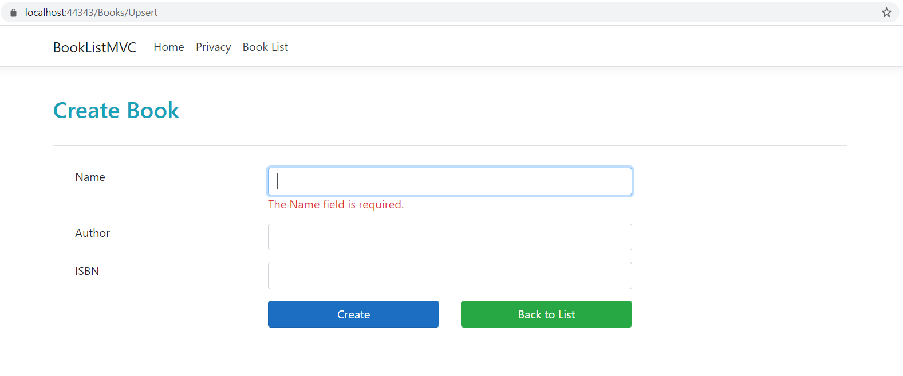
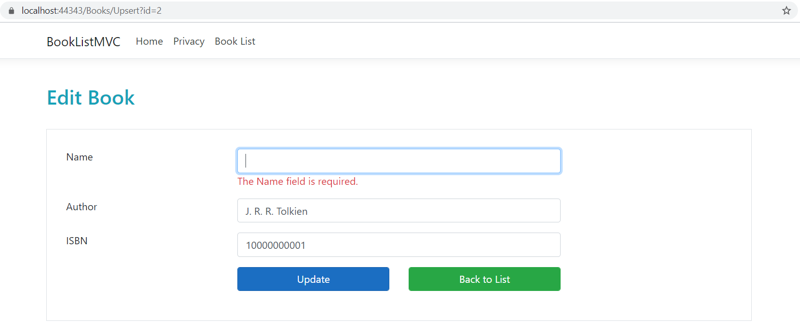
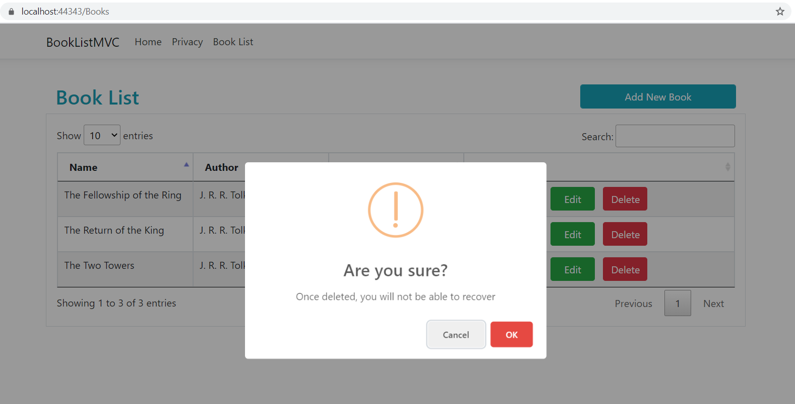
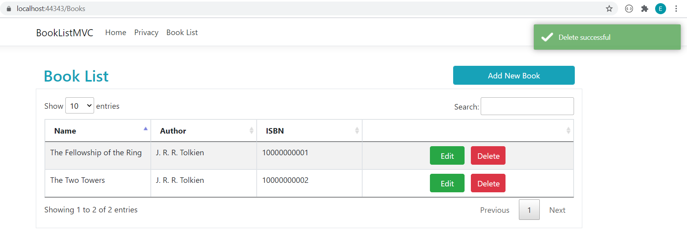

# Book List MVC: ASP.NET Core 3.1 with MVC
In this project, I followed the Udemy tutorial https://www.udemy.com/course/introduction-to-aspnet-core-x.

I created a book list project where I implemented CRUD operations using Entity Framework Core.
This project is created using ASP.NET Core MVC.

Users can add new books to the book list, update books as well as deleting them in this project.
Users can also search books in the book list table.

## Development Environment

ASP.NET Core 3.1 SDK and Sql Server as database are used during project development.
In order to communicate with the database, necessary Entity Framework Core packages are used.
During development, code first database migration approach is embraced.

As a result, ASP.NET Core 3.1 SDK and Sql Server are required to run this project.

## Screenshots

### Index

<i>Image 1: Index View</i>

 

This is the main view of the project where existing books are listed.
On this view, users can navigate to certain views in order to create books or edit them.
Users can also delete books.

There is a button on the upper right side of the view which allows user to redirect
to the Upsert view to create a new book.

The table that is shown on Index view is created using third party libraries such as *DataTables*, *SweetAlert* and *Toastr*.
If user clicks Edit on a certain book, user reaches the Upsert view to edit the book information.
If user clicks Delete on a certain book, SweetAlert is triggered.
When delete operation is confirmed by the user, Toastr messages are shown.

### Upsert (Create)

<i>Image 2: Upsert View (Create)</i>

 

If user clicks on the Add New Book button on Index view, Upsert view for create operation opens.
On Upsert view, user can add a new book to the book list.
Both client and server side validations are implemented.
Successful creation will redirect user to the Index view where the added book can be seen.
If user wants to opt out, Back to List button redirects user to the Index view without any creation.

### Upsert (Edit)

<i>Image 3: Upsert View (Edit)</i>

 

If user clicks on Edit button of a certain book, Upsert view for edit operation opens.
On Upsert view, user can edit fields of that specific book and save changes.
Both client and server side validations are implemented.
A successful update operation will redirect user to the Index view where edited fields can be seen.
If user wants to opt out, Back to List button redirects user to the Index view without any editing done.

### Delete

<i>Image 4: Delete</i>

 

<i>Image 5: Toastr alert</i>

 

If user clicks on Delete button of a certain book on Index view, an alert (SweetAlert) is shown.
Successful delete operation will remove the book from the list.
If user wants to opt out, no changes are made.
Delete operation results are shown to user using Toastr messages.